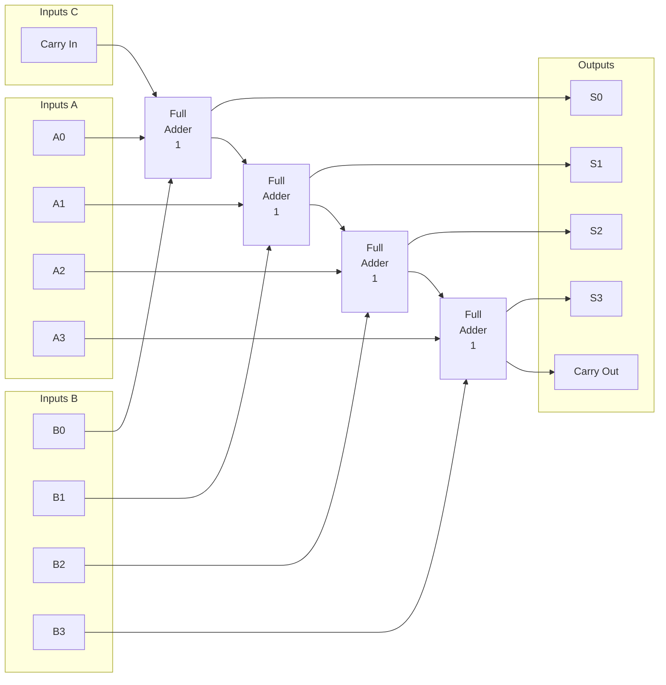
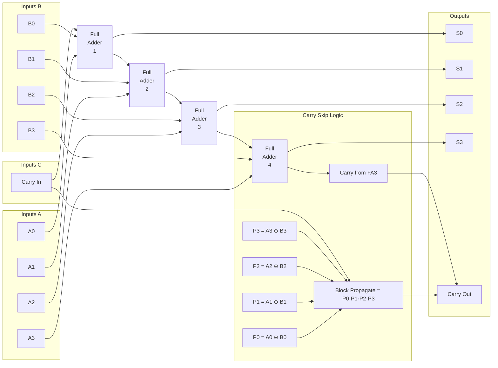

# 1. Full Adder :

## Inputs:
 A, B, Cin
## Outputs:
 Sum (S)
 Carry (Cout)
## Truth Table :
| A | B | Cin | S | Cout |
| - | - | --- | - | ---- |
| 0 | 0 | 0   | 0 | 0    |
| 0 | 0 | 1   | 1 | 0    |
| 0 | 1 | 0   | 1 | 0    |
| 0 | 1 | 1   | 0 | 1    |
| 1 | 0 | 0   | 1 | 0    |
| 1 | 0 | 1   | 0 | 1    |
| 1 | 1 | 0   | 0 | 1    |
| 1 | 1 | 1   | 1 | 1    |

## Karnaugh maps :

Sum (S):
| BC  | 00 | 01 | 11 | 10 |
| --- | -  | -- | -- | -- |
| A=0 | 0  | 1  | 0  | 1  |
| A=1 | 1  | 0  | 1  | 0  |

Carry (Cout) :
| BC  | 00 | 01 | 11 | 10 |
| --- | -  | -- | -- | -- |
| A=0 | 0  | 0  | 1  | 0  |
| A=1 | 0  | 1  | 1  | 1  |

## Result :
S=A⊕B⊕Cin

Cout​=AB+BCin+ACin

# 2. Full Subtractor :

## Inputs:
A, B, Bin
## Outputs:
Difference (D)
Borrow (Bout)

## Truth Table:

| A | B | Bin | D | Bout |
| - | - | --- | - | ---- |
| 0 | 0 | 0   | 0 | 0    |
| 0 | 0 | 1   | 1 | 1    |
| 0 | 1 | 0   | 1 | 1    |
| 0 | 1 | 1   | 0 | 1    |
| 1 | 0 | 0   | 1 | 0    |
| 1 | 0 | 1   | 0 | 0    |
| 1 | 1 | 0   | 0 | 0    |
| 1 | 1 | 1   | 1 | 1    |

## Karnaugh maps :

Difference (D)
| BC  | 00 | 01 | 11 | 10 |
| --- | -  | -- | -- | -- |
| A=0 | 0  | 1  | 0  | 1  |
| A=1 | 1  | 0  | 1  | 0  |

Borrow (Bout) 
| BC  | 00 | 01 | 11 | 10 |
| --- | -  | -- | -- | -- |
| A=0 | 0  | 1  | 1  | 1  |
| A=1 | 0  | 0  | 1  | 0  |

## Result :
D=A⊕B⊕Bin

Bout​=A′B+Bin(A′+B)


# 3. Comparator :

# 4. Ripple Carry Adder (4-bit):




# 5. Carry  skip Adder (4-bit):



# 6. Carry  look ahead  Adder (4-bit):

```mermaid


```


# 7. Adder Subtactor  (4-bit):
```mermaid

```


