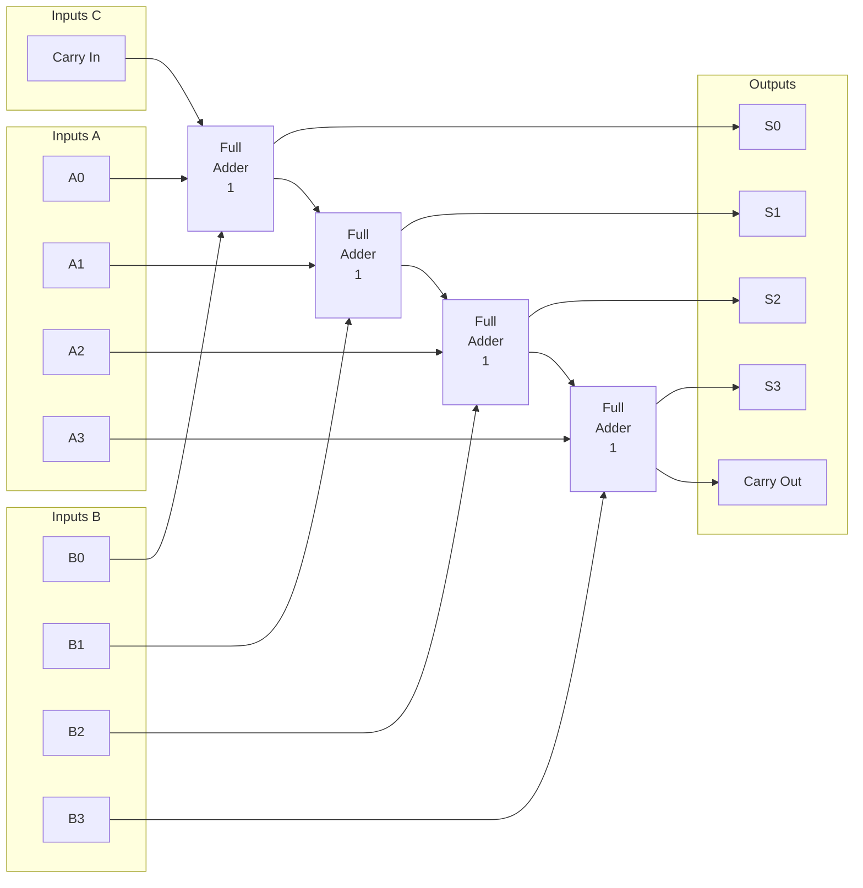
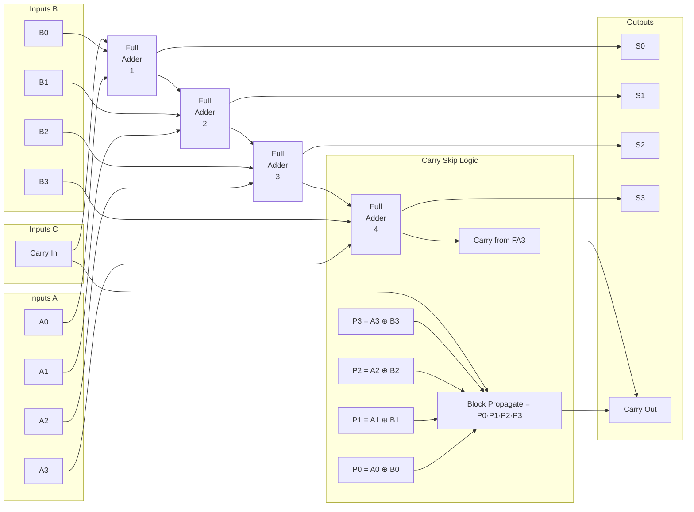
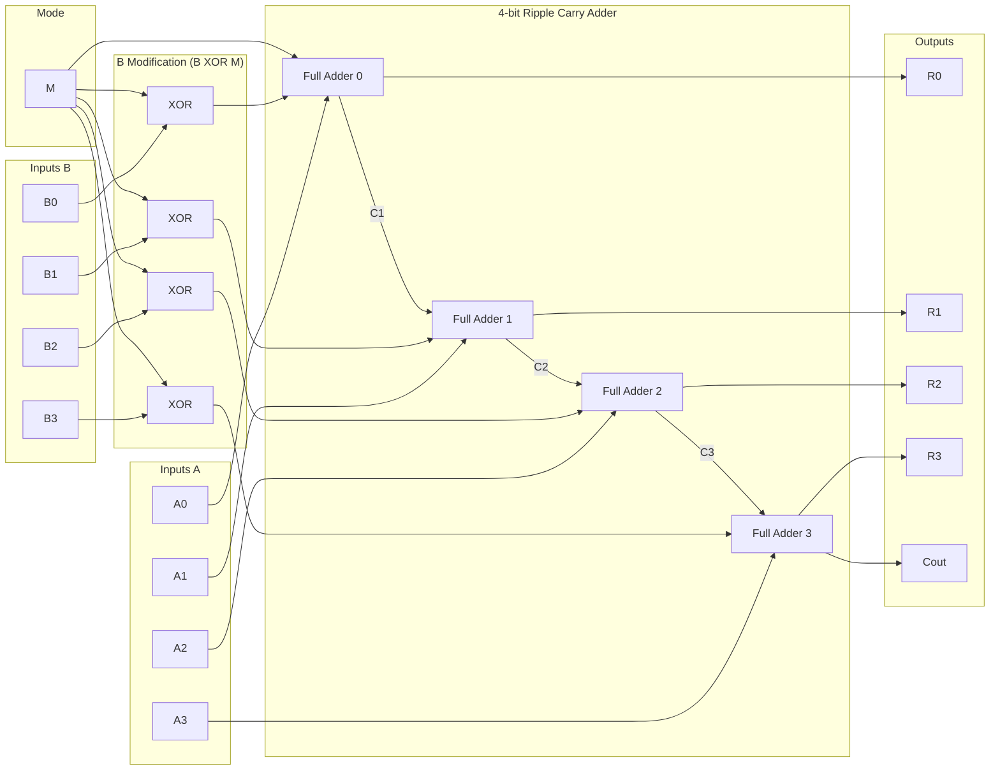
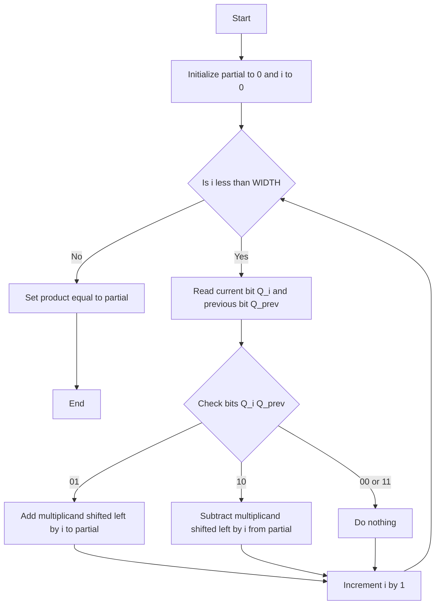
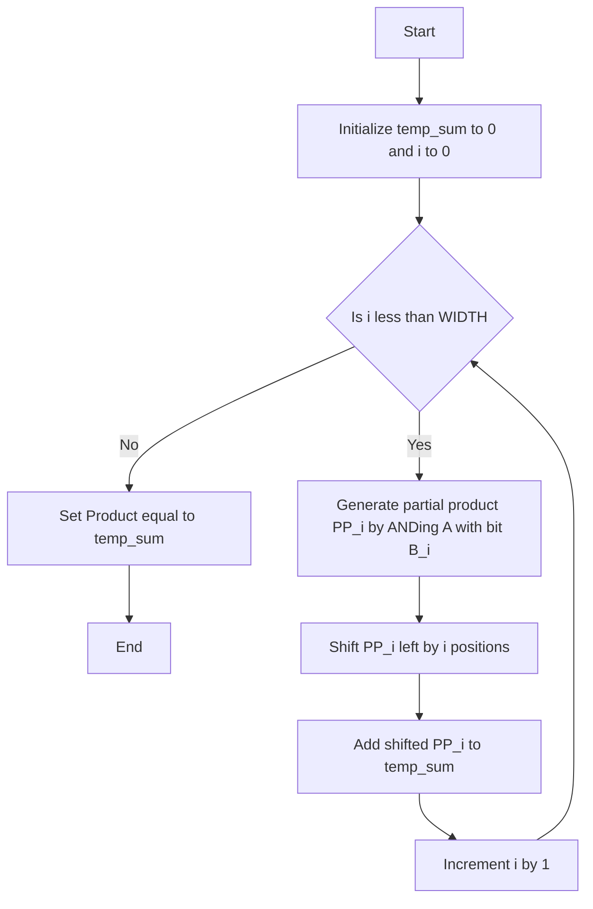

# 1. Full Adder :

Circuit that adds three 1-bit inputs: A, B, and Cin, producing Sum and Cout.

## Inputs:
 A, B, Cin
## Outputs:
 Sum (S)
 Carry (Cout)
## Truth Table :
| A | B | Cin | S | Cout |
| - | - | --- | - | ---- |
| 0 | 0 | 0   | 0 | 0    |
| 0 | 0 | 1   | 1 | 0    |
| 0 | 1 | 0   | 1 | 0    |
| 0 | 1 | 1   | 0 | 1    |
| 1 | 0 | 0   | 1 | 0    |
| 1 | 0 | 1   | 0 | 1    |
| 1 | 1 | 0   | 0 | 1    |
| 1 | 1 | 1   | 1 | 1    |

## Karnaugh maps :

Sum (S):
| BC  | 00 | 01 | 11 | 10 |
| --- | -  | -- | -- | -- |
| A=0 | 0  | 1  | 0  | 1  |
| A=1 | 1  | 0  | 1  | 0  |

Carry (Cout) :
| BC  | 00 | 01 | 11 | 10 |
| --- | -  | -- | -- | -- |
| A=0 | 0  | 0  | 1  | 0  |
| A=1 | 0  | 1  | 1  | 1  |

## Result :
S=A⊕B⊕Cin

Cout​=AB+BCin+ACin

# 2. Ripple Carry Adder (4-bit):

An n-bit adder formed by cascading full adders; carry ripples from LSB → MSB.

Working:
Each stage waits for previous carry → serial propagation.

Delay:

$T_{delay}$ ∝ n

## Pros: 
Simple, low area

## Cons: 
Slow for large n

```mermaid
graph LR
    subgraph Inputs C
        C0[Carry In]
    end
    subgraph Inputs A
        A0[A0]
        A1[A1]
        A2[A2]
        A3[A3]
    end
    subgraph Inputs B
        B0[B0]
        B1[B1]
        B2[B2]
        B3[B3]
    end

    subgraph Outputs
        S0[S0]
        S1[S1]
        S2[S2]
        S3[S3]
        C4[Carry Out]
    end

   Full-Adder-0[Full<br>Adder<br>1<br><br>]
   Full-Adder-1[Full<br>Adder<br>1<br><br>]
   Full-Adder-2[Full<br>Adder<br>1<br><br>]
   Full-Adder-3[Full<br>Adder<br>1<br><br>]

    A0 --> Full-Adder-0
    B0 --> Full-Adder-0
    C0 --> Full-Adder-0

    %% Connect FA0 to outputs and next carry
    Full-Adder-0 --> S0
    Full-Adder-0 --> Full-Adder-1

    %% Connect Inputs and Carry1 to FA1
    A1 --> Full-Adder-1
    B1 --> Full-Adder-1

    Full-Adder-1 --> S1
    Full-Adder-1 -->  Full-Adder-2

    %% Connect Inputs and Carry2 to FA2
    A2 --> Full-Adder-2
    B2 --> Full-Adder-2

    Full-Adder-2 --> S2
    Full-Adder-2 --> Full-Adder-3

    %% Connect Inputs and Carry3 to FA3
    A3 --> Full-Adder-3
    B3 --> Full-Adder-3


    Full-Adder-3 --> S3
    Full-Adder-3 --> C4
```

# 3. Carry  look ahead  Adder (4-bit):

Adder that reduces delay by computing carry in parallel using generate/propagate signals.

## Signals:

$G_i ​= A_iB_i​, P_i ​= A_i⊕B_i$​

## Carry:

$C_{i+1} ​= G_i​ + P_i​C_i$​
```mermaid


```

# 4. Carry  skip Adder (4-bit):

Improves RCA by allowing carry to “skip” blocks when propagation condition holds.

```mermaid

graph LR
    %% Inputs
    subgraph Inputs C
        C0[Carry In]
    end
    subgraph Inputs A
        A0[A0]
        A1[A1]
        A2[A2]
        A3[A3]
    end
    subgraph Inputs B
        B0[B0]
        B1[B1]
        B2[B2]
        B3[B3]
    end

    %% Outputs
    subgraph Outputs
        S0[S0]
        S1[S1]
        S2[S2]
        S3[S3]
        C4[Carry Out]
    end

    %% Full Adder blocks
    FA0[Full<br>Adder<br>1<br><br>]
    FA1[Full<br>Adder<br>2<br><br>]
    FA2[Full<br>Adder<br>3<br><br>]
    FA3[Full<br>Adder<br>4<br><br>]

    %% Input connections
    A0 --> FA0
    B0 --> FA0
    C0 --> FA0

    A1 --> FA1
    B1 --> FA1
    FA0 --> FA1

    A2 --> FA2
    B2 --> FA2
    FA1 --> FA2

    A3 --> FA3
    B3 --> FA3
    FA2 --> FA3

    %% Sum outputs
    FA0 --> S0
    FA1 --> S1
    FA2 --> S2
    FA3 --> S3

    %% Carry Skip Logic subgraph
    subgraph CarrySkipLogic[Carry Skip Logic]
        %% Propagate signals
        P0[P0 = A0 ⊕ B0] --> Pblock
        P1[P1 = A1 ⊕ B1] --> Pblock
        P2[P2 = A2 ⊕ B2] --> Pblock
        P3[P3 = A3 ⊕ B3] --> Pblock
        C0 --> Pblock
        Pblock[Block Propagate = P0·P1·P2·P3]
        %% Output carry
        Pblock --> C4
        FA3 --> C4_FA[Carry from FA3] 
        C4_FA --> C4
    end

```

# 7. Full Subtractor :

Subtracts two bits with borrow input.

## Inputs:
A, B, Bin
## Outputs:
Difference (D)
Borrow (Bout)

## Truth Table:

| A | B | Bin | D | Bout |
| - | - | --- | - | ---- |
| 0 | 0 | 0   | 0 | 0    |
| 0 | 0 | 1   | 1 | 1    |
| 0 | 1 | 0   | 1 | 1    |
| 0 | 1 | 1   | 0 | 1    |
| 1 | 0 | 0   | 1 | 0    |
| 1 | 0 | 1   | 0 | 0    |
| 1 | 1 | 0   | 0 | 0    |
| 1 | 1 | 1   | 1 | 1    |

## Karnaugh maps :

Difference (D)
| BC  | 00 | 01 | 11 | 10 |
| --- | -  | -- | -- | -- |
| A=0 | 0  | 1  | 0  | 1  |
| A=1 | 1  | 0  | 1  | 0  |

Borrow (Bout) 
| BC  | 00 | 01 | 11 | 10 |
| --- | -  | -- | -- | -- |
| A=0 | 0  | 1  | 1  | 1  |
| A=1 | 0  | 0  | 1  | 0  |

## Result :
D=A⊕B⊕Bin

Bout​=A′B+Bin(A′+B)

# 8. Adder Subtactor  (4-bit):

Performs addition or subtraction using same hardware.

Use XOR to invert B when subtracting
Use Cin = 1 for 2’s complement subtraction

```mermaid
graph LR
    subgraph Inputs A
        A0[A0]
        A1[A1]
        A2[A2]
        A3[A3]
    end
    subgraph Inputs B
        B0[B0]
        B1[B1]
        B2[B2]
        B3[B3]
    end

    subgraph Mode
        M[M]
    end

    subgraph XOR_Block["B Modification (B XOR M)"]
        X0[XOR]
        X1[XOR]
        X2[XOR]
        X3[XOR]
    end

    subgraph Adder["4-bit Ripple Carry Adder"]
        FA0[Full Adder 0]
        FA1[Full Adder 1]
        FA2[Full Adder 2]
        FA3[Full Adder 3]
    end

    subgraph Outputs
        R0[R0]
        R1[R1]
        R2[R2]
        R3[R3]
        Cout[Cout]
    end

    %% B XOR M connections
    B0 --> X0
    B1 --> X1
    B2 --> X2
    B3 --> X3

    M --> X0
    M --> X1
    M --> X2
    M --> X3

    %% A inputs to adders
    A0 --> FA0
    A1 --> FA1
    A2 --> FA2
    A3 --> FA3

    %% XOR outputs to adders
    X0 --> FA0
    X1 --> FA1
    X2 --> FA2
    X3 --> FA3

    %% Carry chain
    M --> FA0
    FA0 -->|C1| FA1
    FA1 -->|C2| FA2
    FA2 -->|C3| FA3

    %% Outputs
    FA0 --> R0
    FA1 --> R1
    FA2 --> R2
    FA3 --> R3
    FA3 --> Cout
```

# 9. Booth Mul :

Signed multiplication algorithm that reduces number of additions using bit-pair recoding.

## Pros:

Efficient for signed numbers
Reduces operations

## Cons:

Control complexity

```mermaid
flowchart TD

    A[Start] --> B[Initialize partial to 0 and i to 0]

    B --> C{Is i less than WIDTH}

    C -- No --> Z[Set product equal to partial]
    Z --> END[End]

    C -- Yes --> D[Read current bit Q_i and previous bit Q_prev]

    D --> E{Check bits Q_i Q_prev}

    E -- 01 --> F[Add multiplicand shifted left by i to partial]
    E -- 10 --> G[Subtract multiplicand shifted left by i from partial]
    E -- 00 or 11 --> H[Do nothing]

    F --> I[Increment i by 1]
    G --> I
    H --> I

    I --> C
```

# 10. Wallach Mul :

Fast multiplier using parallel reduction of partial products via carry-save adders.

## Working:

Generate partial products
Reduce using CSA tree
Final addition

## Key Feature:

Parallel reduction → very fast

Delay:

T∝log(n)

## Pros:

High speed

## Cons:

Complex layout

```mermaid
flowchart TD

    A[Start] --> B[Initialize temp_sum to 0 and i to 0]

    B --> C{Is i less than WIDTH}

    C -- No --> Z[Set Product equal to temp_sum]
    Z --> END[End]

    C -- Yes --> D[Generate partial product PP_i by ANDing A with bit B_i]

    D --> E[Shift PP_i left by i positions]

    E --> F[Add shifted PP_i to temp_sum]

    F --> G[Increment i by 1]

    G --> C

```

# 11. Comparator :

Compares two binary numbers.

## Inputs:
A, B
## Outputs:
G,E,L

## Truth Table:
| A | B | G (A>B) | E (A=B) | L (A<B) |
| - | - | ------- | ------- | ------- |
| 0 | 0 | 0       | 1       | 0       |
| 0 | 1 | 0       | 0       | 1       |
| 1 | 0 | 1       | 0       | 0       |
| 1 | 1 | 0       | 1       | 0       |

K-Map (2-variable)

For 
𝐺 = 𝐴 > 𝐵  
| B   | 0 | 1 |
| --- | - | - |
| A=0 | 0 | 0 |
| A=1 | 1 | 0 |

For 
E = 𝐴 == 𝐵  
| B   | 0 | 1 |
| --- | - | - |
| A=0 | 1 | 0 |
| A=1 | 0 | 1 |

For 
E = 𝐴 < 𝐵  
| B   | 0 | 1 |
| --- | - | - |
| A=0 | 0 | 1 |
| A=1 | 0 | 0 |

## Final Comparator Equations:

 G=AB′

 E=A′B′+AB

 L=A′B

